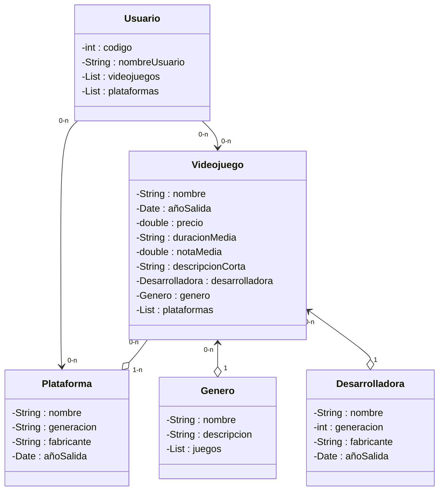

# PROGRAMA VIDEOJUEGOS

## Descripcion

PROGRAMA VIDEOJUEGOS es una aplicación desarrollada en Java que simula la gestión de una base de datos de usuarios con sus respectivas plataformas y videojuegos. La aplicación funciona como un tracker personal de videojuegos, permitiendo a los usuarios registrar y gestionar su colección de juegos.

### Funcionalidades Principales

- Gestión de usuarios con identificador único y nombre de usuario
- Catálogo de videojuegos con información detallada (nombre, año de salida, precio, duración, calificación)
- Seguimiento del estado de los juegos (sin empezar, en progreso, completado)
- Registro de desarrolladoras y sus videojuegos asociados
- Clasificación de juegos por género
- Gestión de plataformas de juego
- Asociación de juegos con múltiples plataformas
- Persistencia de datos mediante DAO (Data Access Object)

## Arquitectura del Proyecto



## Requerimientos

### Requisitos del Sistema

- Java Development Kit (JDK) 25 o superior
- Maven 3.6.0 o superior
- Git (para clonar el repositorio)

### Dependencias del Proyecto

- JUnit Jupiter 5.11.0 (para pruebas unitarias)

## Instalacion

### Pasos para instalar el proyecto

1. Clonar el repositorio:
```bash
git clone https://github.com/usuario/programavideojuegos.git
cd programavideojuegos
```

2. Compilar el proyecto:
```bash
mvn clean compile
```

3. Descargar las dependencias:
```bash
mvn dependency:resolve
```

## Ejecucion

### Compilar el proyecto

```bash
mvn clean package
```

### Ejecutar la aplicación principal

```bash
mvn exec:java -Dexec.mainClass="org.palomafp.programavideojuegos.App"
```

### Ejecutar pruebas unitarias

```bash
mvn test
```

### Ejecutar una clase de prueba específica

```bash
mvn test -Dtest=AppTest
```

### Generar documentación Javadoc

```bash
mvn javadoc:javadoc
```

La documentación generada estará disponible en `target/site/apidocs/`

## Estructura del Proyecto

```
programavideojuegos/
├── src/
│   ├── main/
│   │   └── java/
│   │       └── org/palomafp/programavideojuegos/
│   │           ├── App.java                    (Clase principal de la aplicación)
│   │           ├── Usuario.java                (Modelo: Usuario)
│   │           ├── Videojuego.java             (Modelo: Videojuego)
│   │           ├── Desarrolladora.java         (Modelo: Desarrolladora)
│   │           ├── Genero.java                 (Modelo: Género)
│   │           ├── Plataforma.java             (Modelo: Plataforma)
│   │           └── UsuariosDAO.java            (Data Access Object para usuarios)
│   └── test/
│       └── java/
│           └── org/palomafp/programavideojuegos/
│               ├── AppTest.java                (Pruebas de la aplicación)
│               └── DatosDAOTest.java           (Pruebas del DAO)
├── pom.xml                                     (Configuración de Maven)
├── README.md                                   (Este archivo)
└── doc/
    └── descripcion.md                          (Documentación adicional)
```

## Descripcion de Clases

### Usuario
Representa un usuario del sistema que puede tenermúltiples videojuegos y plataformas asociadas.

### Videojuego
Contiene la información de un videojuego incluyendo desarrolladora, género, plataformas disponibles y estado de progreso del usuario.

### Desarrolladora
Representa una empresa desarrolladora de videojuegos con información like nombre, ubicación y año de fundación.

### Genero
Define un género de videojuegos con su descripción y lista de juegos asociados.

### Plataforma
Representa una plataforma de juego (consola, PC, móvil) con información de generación y fabricante.

### UsuariosDAO
Implementa el patrón Data Access Object para la gestión de persistencia de usuarios.

## Contribucion

Las contribuciones son bienvenidas. Para contribuir al proyecto, siga los siguientes pasos:

### Proceso de Contribución

1. Clonar el repositorio y crear una rama para su feature:
```bash
git checkout -b feature/nombre-de-la-funcionalidad
```

2. Realizar los cambios necesarios

3. Asegurarse de que el código cumple con los estándares:
   - Usar comentarios JavaDoc en métodos y clases públicas
   - Mantener la consistencia de nombres siguiendo convenciones Java
   - No usar emoticonos en comentarios

4. Ejecutar las pruebas para verificar que todo funciona:
```bash
mvn test
```

5. Hacer commit de los cambios:
```bash
git commit -m "Descripcion clara del cambio realizado"
```

6. Hacer push a la rama:
```bash
git push origin feature/nombre-de-la-funcionalidad
```

7. Crear un Pull Request describiendo los cambios realizados

### Estándares de Código

- Seguir las convenciones de nombres de Java (camelCase para variables y métodos, PascalCase para clases)
- Documentar mediante JavaDoc todos los métodos públicos
- Mantener las líneas de código bajo 120 caracteres de ancho
- Usar try-with-resources para manejo de recursos
- Evitar código duplicado mediante refactorización
- Escribir pruebas unitarias para nuevas funcionalidades

### Reportar Problemas

Si encuentra algún problema, por favor cree un issue describiendo:
- Descripción clara del problema
- Pasos para reproducir el error
- Comportamiento esperado vs actual
- Información del sistema (JDK version, SO, etc.)

## Informacion Adicional

### Autor

Andrés López de la Vía

### Estado del Proyecto

En desarrollo. El proyecto está en una fase inicial de desarrollo y se espera agregar más características en el futuro.
