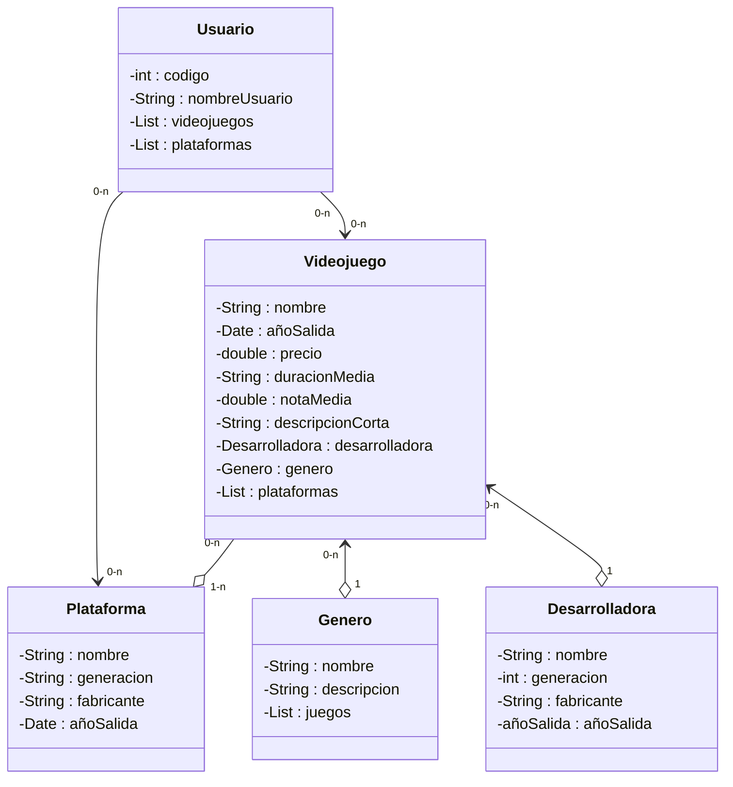

# PROGRAMA VIDEOJUEGOS
Este es un programa en java que simula la gestion de una pequeña base de datos de usuarios con sus plataformas y videojuegos, el objetivo es terminar con una app que funcione como un tracker de los juegos de un usuario.

