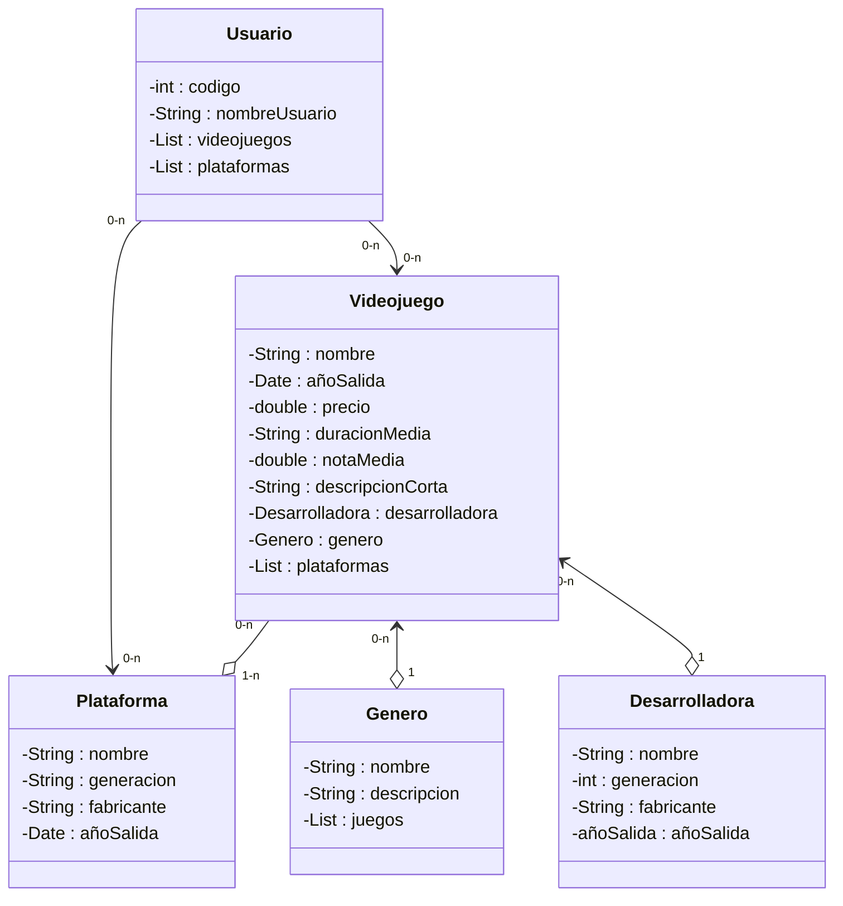

# Programa de Videojuegos
## Clases:
* **Usuario**
* **Videojuego**
* **Desarrolladora**
* **Genero**
* **Plataforma**
## Relaciones y datos:
Este es un programa para que usuarios gestionen su progreso en diferentes videojuegos, cada **usuario** tendra un codigo, un nombre de usuario y su listado de videojuegos, plataformas de salida, los **videojuegos** tendran su estado (sin empezar, en progreso, completado), nombre, año de salida, precio, genero, su desarrolladora, duracion media, nota media del juego y una descripcion corta, la **desarrolladora** tendra el nombre, ubicacion, listado de videojuegos y descripcion corta, la clase **genero** tendra el nombre del genero, una descripcion corta, y listado de juegos que sean de este genero, la clase **plataforma** tendra su nombre, su generacion, año de salida y su fabricante.
## Diagrama de clase 
